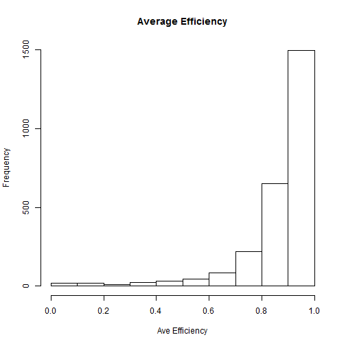

## Background & Goals

- Angel Flight West is a non-profit organization which provides transportation to medical treatment for people in need.
- Volunteer pilots fly people in their own airplanes, and pay the cost of the flights
- There is no charge to the passengers
- Flights are scheduled based on the passengers' needs, so the routing is highly varied
- The goal of this exercise is to find more efficient matches between volunteer pilots and the flights
- One metric of the match is called "efficiency"
- Efficiency is how far out of the way the pilot must fly from his or her home airport to complete the passenger's desired routing
- Efficiency is expressed as a percentage, where 100% efficient means that they pilot does not need to go out of their way at all

--- .class #id 

## Dataset

- For all pilots in our history, we calculated the average efficiency of all of their flights
- Questions:
  - How close to being 100% efficient does a flight need to be for a pilot to consider it a match?
  - Are there clusters of pilots where their tolerance for less efficiency varies?
  - Does the average vary based on the total missions a pilot has flown?

--- .class #id 

## Shiny app

The Shiny app allows the user to view and interactively compare the distribution of the average efficiency based on
the pilot's total missions to see if there is any correlation.

 

--- .class #id 

## Results

Below is the result of some executable R code which provides a summary of one of the datasets. The app seems
to indicate that there is no substantial difference in the distribution based on lifetime missions. All pilots
appear to want efficiency to be in the 80 percent range.

```{r echo=FALSE}
x <- read.csv("pilot_ave_efficiency_1.csv",header=TRUE,quote="")
summary(x)
```
